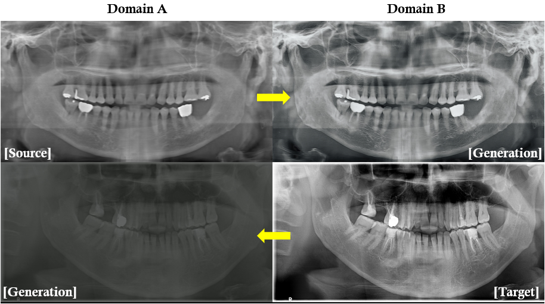

# Super Resolution of Synthetic Panoramic Radiography with CycleGAN in PyTorch



<br><br><br>

## Prerequisites
- Linux or macOS
- Python 3
- CPU or NVIDIA GPU + CUDA CuDNN

## Getting Started
### Installation
- Install [PyTorch](http://pytorch.org) and 0.4+ and other dependencies (e.g., torchvision, [visdom](https://github.com/facebookresearch/visdom) and [dominate](https://github.com/Knio/dominate)).

- Clone this repo:
```bash
git clone https://github.com/rnbok/Panoramic_super_resolution_CycleGAN.git 
cd Panoramic_super_resolution_CycleGAN
```


### CycleGAN train/test
- Download a CycleGAN dataset (e.g. maps):
```bash
bash ./datasets/download_cyclegan_dataset.sh maps
```
- To view training results and loss plots, run `python -m visdom.server` and click the URL http://localhost:8097.
- To log training progress and test images to W&B dashboard, set the `--use_wandb` flag with train and test script
- Train a model:
```bash
#!./scripts/train_cyclegan.sh
python train.py --dataroot ./datasets/maps --name ct2pano --model cycle_gan
```
To see more intermediate results, check out `./checkpoints/ct2pano/web/index.html`.
- Test the model:
```bash
#!./scripts/test_cyclegan.sh
python test.py --dataroot ./datasets/maps --name ct2pano --model cycle_gan
```
- The test results will be saved to a html file here: `./results/ct2pano/latest_test/index.html`.


### Apply a pre-trained model (CycleGAN)
- You can download a pretrained model (e.g. ct2pano)
- The pretrained model is saved at `./checkpoints/{name}_pretrained/latest_net_G.pth`.
- To test the model, you also need to download the  ct2pano test dataset.

- Then generate the results using
```bash
python test.py --dataroot datasets/ct2pano/testA --name ct2pano_pretrained --model test --no_dropout
```

## [Datasets](docs/datasets.md)
Download pix2pix/CycleGAN datasets and create your own datasets.

## Custom Model and Dataset
If you plan to implement custom models and dataset for your new applications, we provide a dataset [template](data/template_dataset.py) and a model [template](models/template_model.py) as a starting point.

## [Code structure](docs/overview.md)
To help users better understand and use our code, we briefly overview the functionality and implementation of each package and each module.

## Citation
If you use this code for your research, please cite the original papers.

```
@inproceedings{CycleGAN2017,
  title={Unpaired Image-to-Image Translation using Cycle-Consistent Adversarial Networks},
  author={Zhu, Jun-Yan and Park, Taesung and Isola, Phillip and Efros, Alexei A},
  booktitle={Computer Vision (ICCV), 2017 IEEE International Conference on},
  year={2017}
}

@inproceedings{isola2017image,
  title={Image-to-Image Translation with Conditional Adversarial Networks},
  author={Isola, Phillip and Zhu, Jun-Yan and Zhou, Tinghui and Efros, Alexei A},
  booktitle={Computer Vision and Pattern Recognition (CVPR), 2017 IEEE Conference on},
  year={2017}
}
```
## Acknowledgments
The code is heavily relied upon CycleGAN [pytorch-CycleGAN](https://github.com/junyanz/pytorch-CycleGAN-and-pix2pix)
